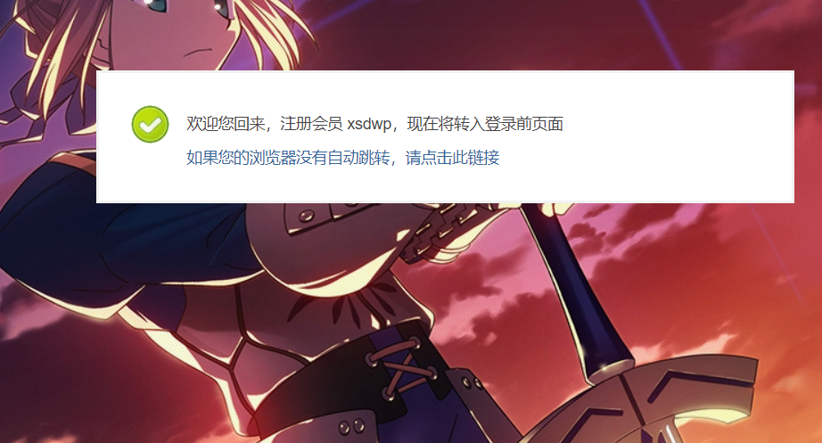
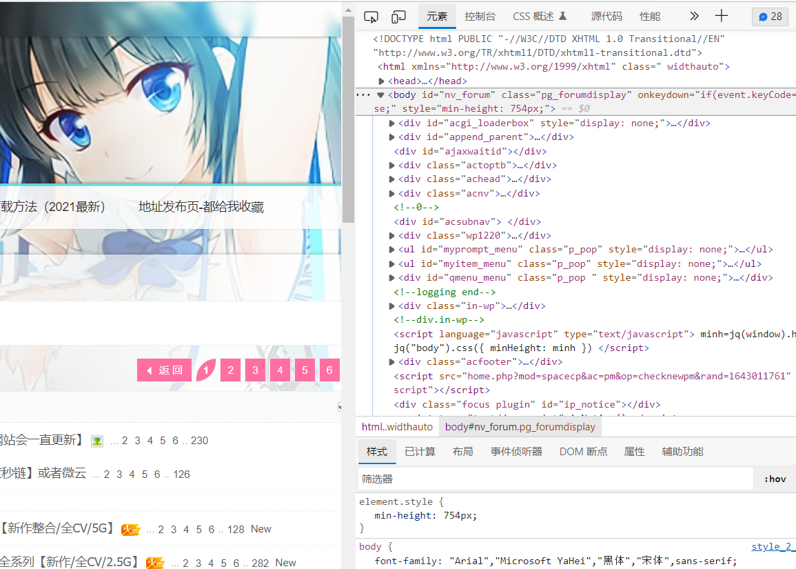
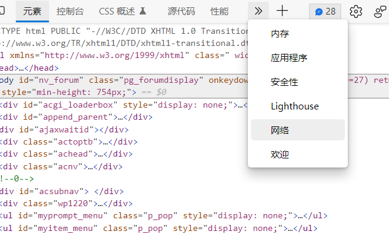
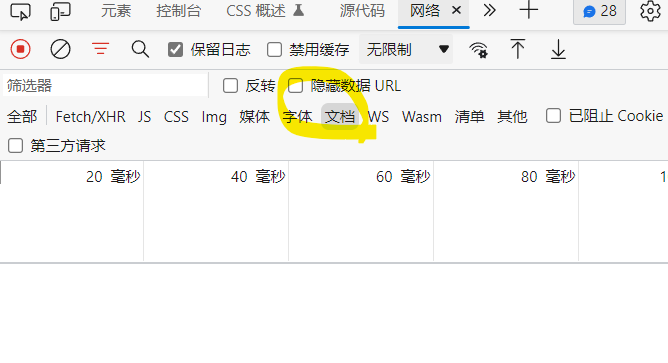
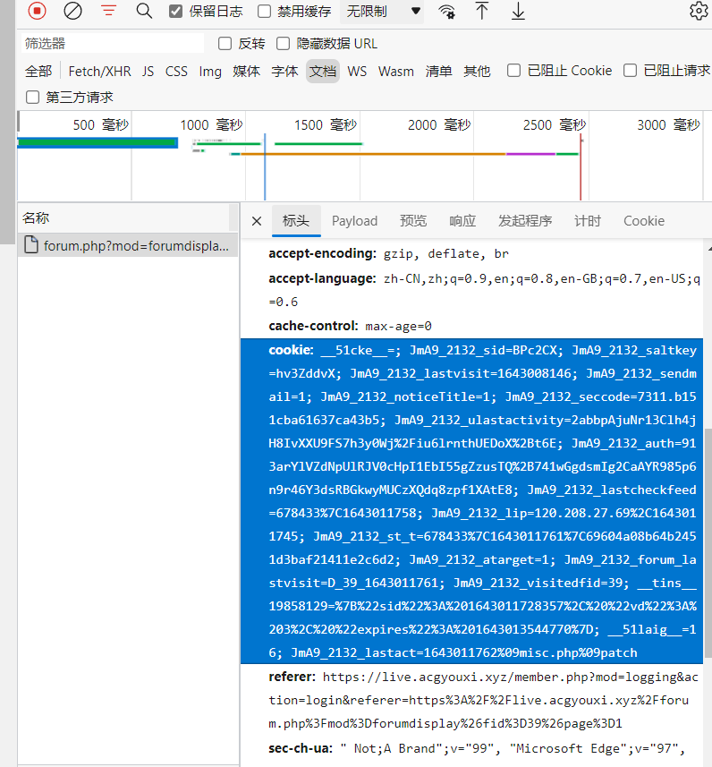

# discuz-crawler

### 介绍
使用selenium对Discuz建站的论坛发布资源进行爬取，自动评论获取隐藏内容，转存飞猫云

### 项目地址
Github: https://github.com/Yaaprogrammer/discuz-crawler

Gitee: https://gitee.com/xsdwptg/discuz-crawler

### 支持浏览器类型
|浏览器|
|---|
|Edge|
|Chrome|

### 目标论坛
[ACG次元网](https://live.acgyouxi.xyz)

### 论坛简介
该论坛访问必须登录，每个话题需要回复获取隐藏内容，隐藏内容中有资源链接。本项目主要获取其中的飞猫云链接并转存到橘猫云，转存按钮有滑块验证码。

ps:飞猫云需要开通VIP

### 模块介绍
|名称|描述|参数|
|---|---|---|
|PostStatusDetector|查看帖子状态，收集信息|-d|
|CommentPublisher|回复隐藏资源的帖子|-c|
|FeiMaoDiskTransferor|转存所有飞猫云资源|-f|
|FileStatusDetector|查看网盘文件状态，手机信息|-k|

### 依赖
| 名称 | 描述 |
| --- | --- |
| Selenium | 模拟操作浏览器 |
| Pyyaml | 读取yaml格式配置文件 |
| Pillow | 图像处理标准库 |
| Aiohttp | 异步网络请求库 |
| Requests | 同步网络请求库 |
| Loguru| 日志框架 |
| Merry | 异常处理库 |
| tenacity | 快速重试库 |

### 使用教程
1. 克隆仓库
```
git clone https://gitee.com/xsdwptg/discuz-crawler.git # Gitee仓库
```
```
git clone https://github.com/Yaaprogrammer/discuz-crawler.git # 或Github仓库
```
2. 安装依赖
```
pip install -r requirements.txt
```
3. 下载驱动
   
   根据自己的浏览器版本下载对应驱动
- Edge驱动: https://developer.microsoft.com/en-us/microsoft-edge/tools/webdriver/
- Chrome驱动: https://npm.taobao.org/mirrors/chromedriver

4. 复制配置模板文件
   
   复制 `./config_template/config.yml` 到 `./src/resource/config.yml`
   
5. 配置驱动
   
   - 打开config.yml，在driver的path项中输入驱动路径
   ```
   driver: 
        path: ./chromedriver.exe
   ```
    - 在driver的type项中输入驱动类型(Edge/Chrome)
   ```
   driver: 
        type: Chrome
   ```
    - 使用Edge浏览器驱动需要额外修改edge/bin_path配置项，写入Edge浏览器本身的路径(exe文件)
   ```
   edge:
      bin_path: C:\Program Files (x86)\Microsoft\Edge\Application\msedge.exe
   ``` 
6. 配置爬虫
   ```
   thread_min: 100 # 帖子ID最小值
   thread_max: 500 # 帖子ID最大值
   comment_sleep: 11 # 评论间隔时间
   comment_message: 66666666666666666 #评论内容
   ```
7. 配置Cookie
   
   在cookies配置项中分别写入目标论坛和飞猫云的Cookie
    _____
    如何获取Cookie?
    _____
    1. 登录目标网站
   
    1. 按F12打开开发者工具
   
    1. 切换到"网络"选项卡
   
    1. 点击"文档"按钮
   
    1. 刷新当前页面，选中开发者工具中出现的项，在请求头部分中找到cookie项，复制"cookie: "之后的值
   
    1. 飞猫云cookie获取同理
8. 运行程序
   ```
   python ./src/main.py -d # 运行PostStatusDetector模块
   ```
   ```
   python ./src/main.py -c # 运行CommentPublisher模块
   ```
   ```
   python ./src/main.py -f # 运行FeiMaoDiskTransferor模块
   ```
   ```
   python ./src/main.py -k # 运行FileStatusDetector模块
   ```

